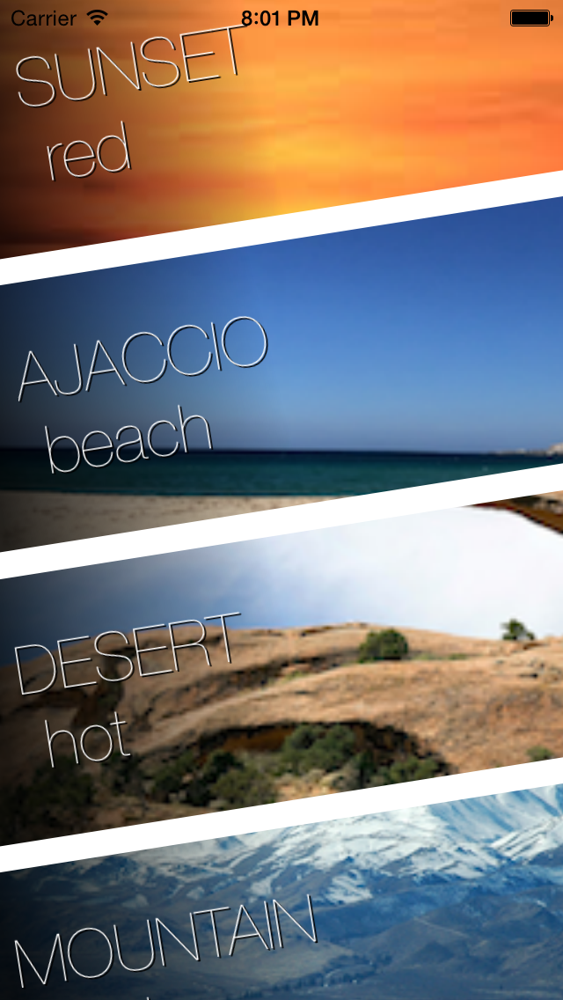

MPSkewed
=================


## History

I wanted to make something like this since I saw [this collectionView](http://capptivate.co/2014/01/18/timbre-2/)
While I was waiting to have the time to make it [TWRSkewedCollectionView](https://github.com/chasseurmic/TWRSkewedCollectionView) came out.
Suddenly I forked it and [decided to contribute](https://github.com/MP0w/TWRSkewedCollectionView/commits/master),
I was going to add the parallax effect when I realized that there were some decision that I didn't like so I preferred to use that as a base but I need to edit a lot of stuff that probably the original owner do not want to change.
For example: I want a collection view that works like any other collectionView, where the user needs to provide a dataSource instead of load a simple list of URL for the images.
just to have it as exensible as the original CollectionView, and have more reusable code.
I don't like nib, and this project shouldn't be a collectionview but just a cell (+ layout for the parallax
Even for the way how the original is structured is difficult to add the parallax effect or edit the behaviors, and it becomes too much confusionary...
Instead of use a custom collectionView+cell+layout here you just have to use the cell (and the layout if you want the parallax)... I tried to made something that preserve all the other behaviors and settings disponible in the collectionView

At the end I guess there is no code shared between the two, TWRSkewedCollectionView is just simple to use but not really reusable/customizable since it does all inside the collection view subclass and the delegate and datasource are broken, however it's a good work, just I wanted it different.

## MPSkewed
If you want to have the skewed cell without parallax just use the cell class, just note that you should use a collection view layout like the flow layout in wich you have all the cell's height equal and the line spacing equal to -height/3 (that even resolve the problem that cell is reused before it really disappear because of the imageview that go outside the cell).
This is the more clean way to have cell tappable everywhere and you can adjust the padding from the cells using the lineSpacing property of MPSkewedCell.
I could use an internal delegate + objcRuntime to preserve the delegates [like I did here](https://github.com/MP0w/TWRSkewedCollectionView/commits/master), but to preserve all the delegates it would become not so clean...
the only problem of my new choice is that : you can't use differents sizes for the cells and the real itemSize is different from the one you specify,
passing 300 it become : 300*2/3-lineSpacing.
If some people will tell me that this choice is not the best maybe I will return to my initial approach [my initial approach](https://github.com/MP0w/TWRSkewedCollectionView/commits/master)


resume :
```objective-c
    // you can use that if you don't need parallax
    UICollectionViewFlowLayout *layout=[[UICollectionViewFlowLayout alloc] init];
    layout.itemSize=CGSizeMake(self.view.width, 230);
    layout.minimumLineSpacing=-layout.itemSize.height/3; // must be always the itemSize/3
    
    //use the layout you want as soon as you recalculate the proper spacing if you made different sizes
```   
if you need parallax
```objective-c
    MPSkewedParallaxLayout *layout=[[MPSkewedParallaxLayout alloc] init];    
```    




## License

Usage is provided under the [MIT License](http://opensource.org/licenses/mit-license.php).  See LICENSE for the full details.
